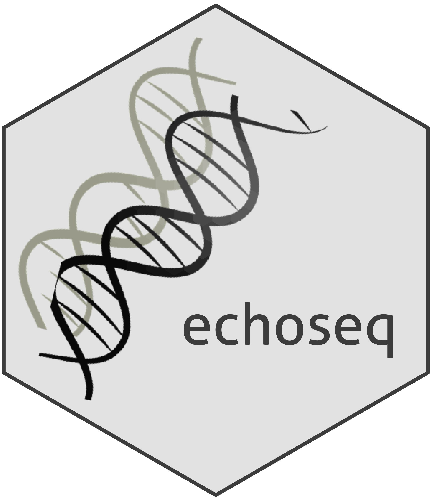

<!-- README.md is generated from README.Rmd. Please edit that file -->
<!-- First time: run usethis::use_readme_rmd() to create a pre-commit hook that 
prevents from committing if the README.Rmd has changed, but has not been 
re-knitted to generate an updated README.md -->

## echoseq: Faithful replication and simulation of molecular and clinical data 

<!-- Run for the R CMD checks, run usethis::use_github_actions() to set up the pipeline, possibly modify the .yaml file and then: -->

[](https://travis-ci.org/hruffieux/echoseq)
[](https://github.com/hruffieux/echoseq/actions)
[](https://www.gnu.org/licenses/gpl-3.0)
[](https://github.com/hruffieux/echoseq)
[](https://github.com/hruffieux/echoseq)

## Overview

**echoseq** is an R package providing functions to emulate molecular
quantitative trait locus data, and clinical data associated with genetic
variants under user-specified association patterns. The data can be
obtained by pure simulation or can replicate real datasets supplied by
the user. Datasets simulated using **echoseq** may replace real datasets
when these cannot be shared for diverse privacy reasons. The data
generation schemes are based on generally accepted principles of
population genetics (Hardy–Weinberg equilibrium, linkage-disequilibrium,
natural selection, pleiotropic control, sparsity assumptions, epigenetic
control, etc).

## Installation

To install, run the following commands in R:

``` r
if(!require(remotes)) install.packages("remotes")
remotes::install_github("hruffieux/echoseq")
```

## License and authors

This software uses the GPL v3 license, see [LICENSE](LICENSE). Authors
and copyright are provided in [DESCRIPTION](DESCRIPTION).

## Issues

To report an issue, please use the [echoseq issue
tracker](https://github.com/hruffieux/echoseq/issues) at github.com.
